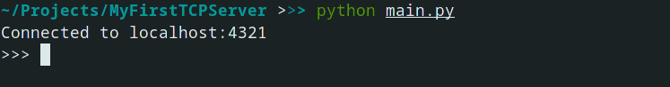

# Práctica de Telemática 👍

En este repositorio se almacena el código de un protocolo de prueba, desarrollado en Python, este, se encarga de transmitir paquetes en dos direcciones, siendo estas el cliente y el servidor, el cliente se encarga de enviar comandos y el servidor le responde de manera reactiva, dependiendo del comando enviado. 

### Comandos del Cliente

- `mkbk`: Este comando permite la creación de un Bucket, después de haber ejecutado la orden, puede responder una de dos opciones, que el Bucket fue creado con éxito, o que este ya existía. *Uso :*`mkbk <Bucketname>`

- `rmbk`: Este comando permite la eliminación de un Bucket, después de haber ejecutado la orden, puede responder una de dos opciones, que el Bucket fue eliminado con éxito, o que este no existe.  *Uso :*`rmbk <Bucketname>`

- `upfl`: Este comando permite la subida de un archivo desde el cliente al servidor, con este se garantiza su permanencia hasta que se decida eliminarlo, el cliente decide también en que Bucket será almacenado el archivo.
  
  *Uso :*`upfl <Bucketname> <filename>`

- `dwfl`: Este comando permite la descarga de un archivo específico desde el servidor hacia el cliente, este decide también de que Bucket será descargado el archivo *Uso :*`dwfl <Bucketname> <filename>`

- `rmfl`: Este comando elimina el archivo especificado de los archivos que se encuentran dentro del servidor. _Uso :_ `rmfl <Bucketname> <filename>`

- `lsbk`: Este comando lista los Buckets creados que el servidor identifica. 
   *Uso* : `lsbk`

- `lsfl`: Este comando lista los archivos que se encuentren en el servidor, y los almacena en un bucket. *Uso :* `lsfl <Bucketname>`

### Imagenes

.png)

### Desarrolladores

- Alfredo J. Ospino (ajospino)
- Stiven Agudelo (sagudeloo)

